# Open NSynth Super case

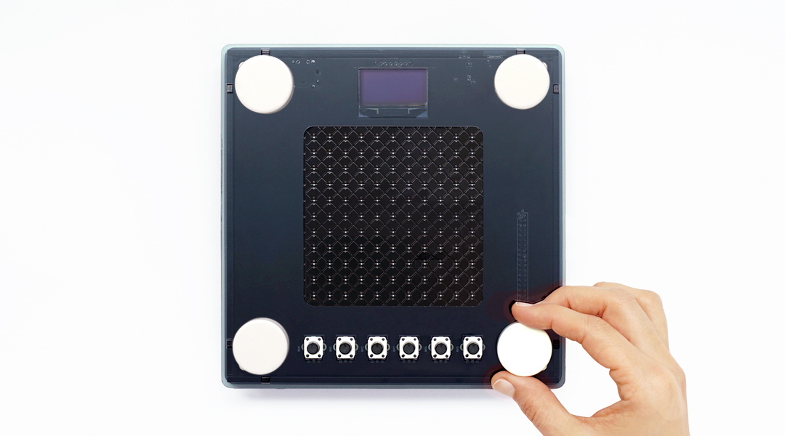

This directory contains all of the source files you will need to construct your own case for an Open NSynth Super unit. These files are provided as a reference design and are intended to be modified.

If you're in the process of building an Open NSynth Super for the first time, it's strongly advised that you make assembling your instrument into a case your last step, as you'll need access to ports for debugging.

# About the files

### Laser cutting template

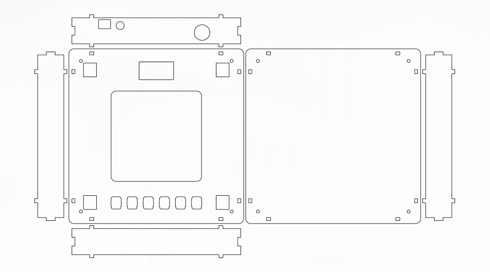

- [NSynth_Super_Lasercut_Template.dxf](NSynth_Super_Lasercut_Template.dxf)
- [NSynth_Super_Lasercut_Template.ai](NSynth_Super_Lasercut_Template.ai)

Templates for laser cutting the reference case design are provided in Adobe Illustrator and DXF format.

### Dial designs for 3D printing

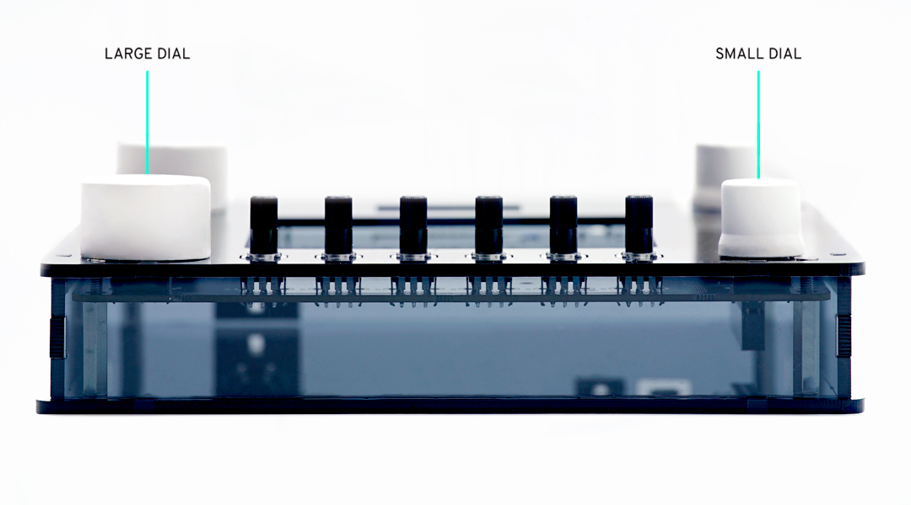

- [NSynth_Super_Dial_Big.stl](NSynth_Super_Dial_Big.stl)
- [NSynth_Super_Small_Dial.stl](NSynth_Super_Small_Dial.stl) 

There are two 3D-printable dial designs for the Open NSynth Super's instrument selection encoders. The larger dial requires you to countersink the mounting screws into the face of the top plate.

### Parts

- A sheet of 3mm thick, laser cuttable material (approx. 430mm x 260mm)
- 8 x 12mm M3 screws
- 4 x 20mm M3 standoffs 
- 4 x 3.2mm self retaining spacers
- Allen keys or screwdriver (depending on screw socket)

A bill of materials for the whole project is [available here](https://storage.googleapis.com/open-nsynth-super/onss_bom_1.2.0.xlsx).

# Building the case

Start by downloading the .ai or .dxf file from this repository for laser cutting. If necessary, load the files and edit for compatibility with your laser cutter (depending on the brand and model of the laser cutter you are using the setting will vary).

Attach the self retaining spacers to the PCB as shown.

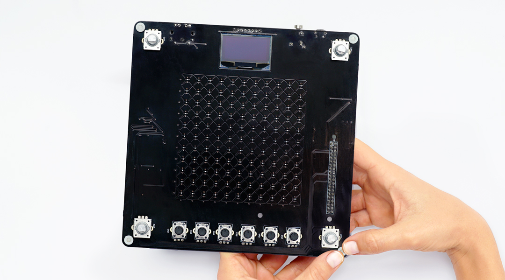

Use four of the 12mm M3 screws to fasten the 20mm standoffs to the bottom face of the case.

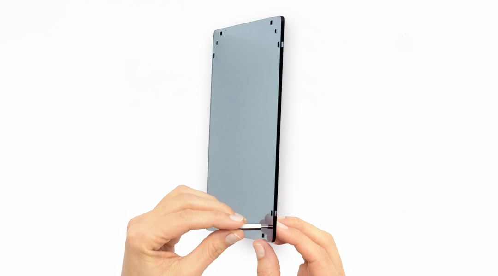

Position the PCB on the standoffs so that the drill holes are aligned with the screw holes of the standoffs.

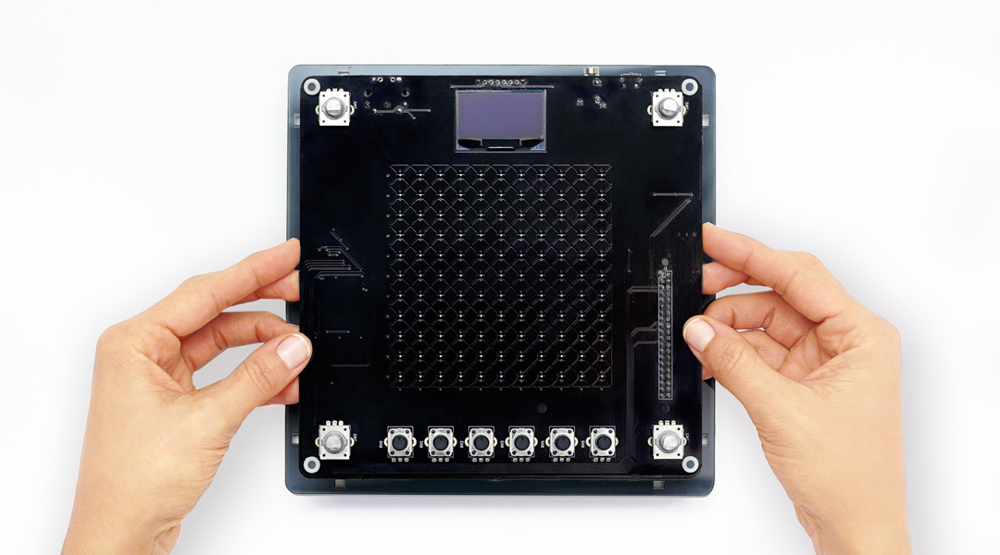

Slot the back panel of the case into the base.

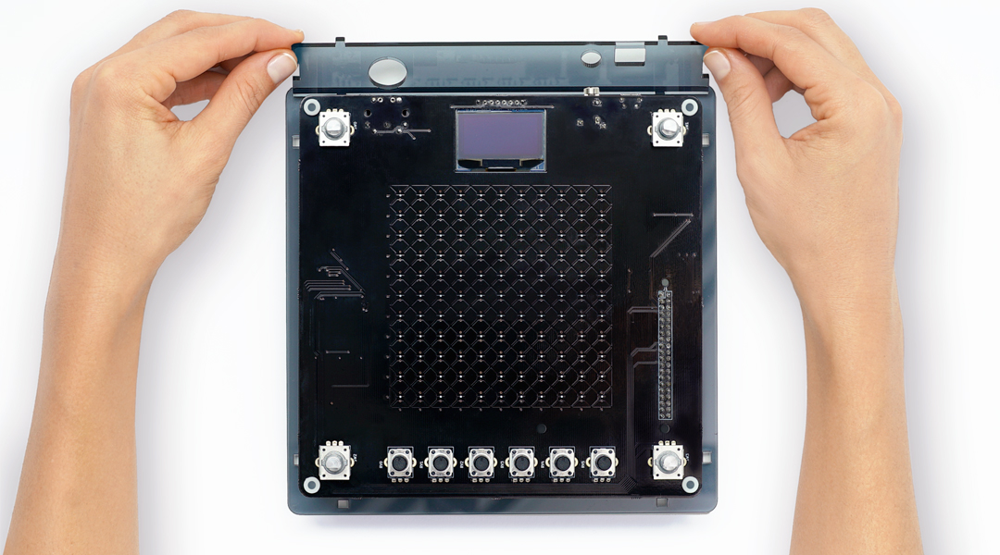

Fit the remaining side and front faces to the base and slot together the corner joints.

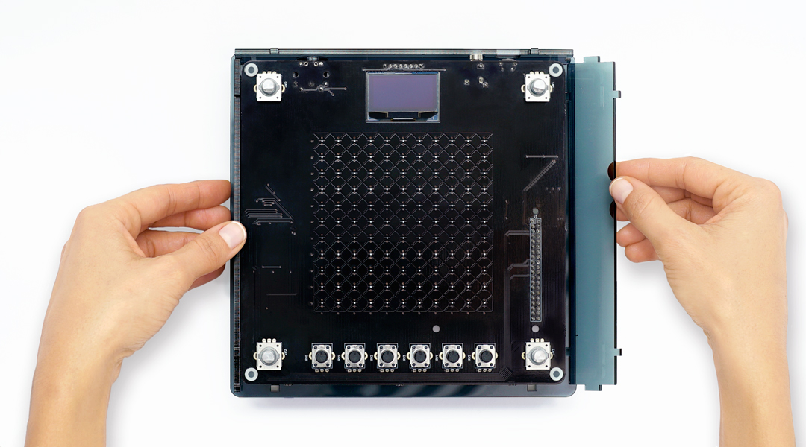

Place the top face over the PCB, aligning the teeth with the side panels.

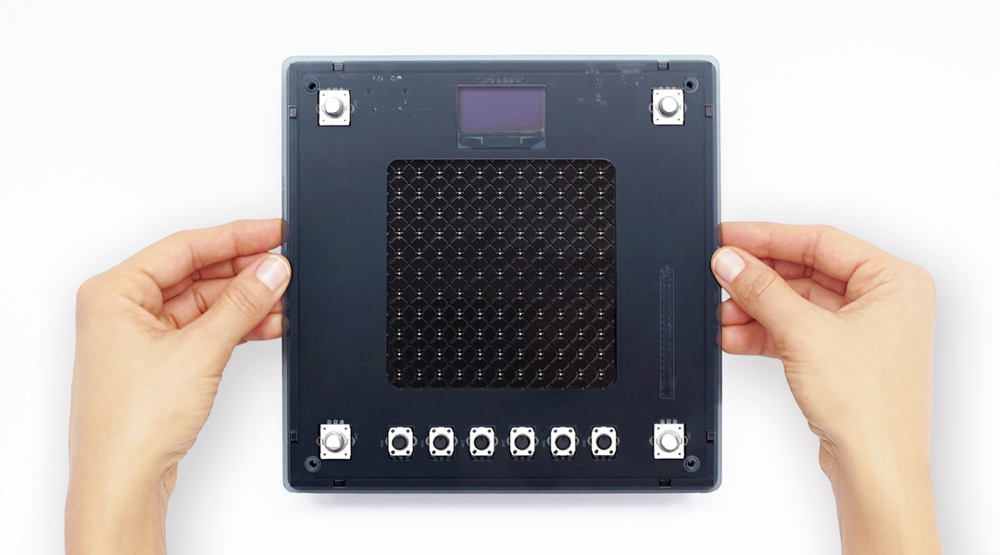

Screw the top face in place using the other four 12mm M3 screws. If you are using a dial with a radius bigger than 9.5 mm, such as the larger example in this repository, the top screws need to be countersunk using a pillar drill. 

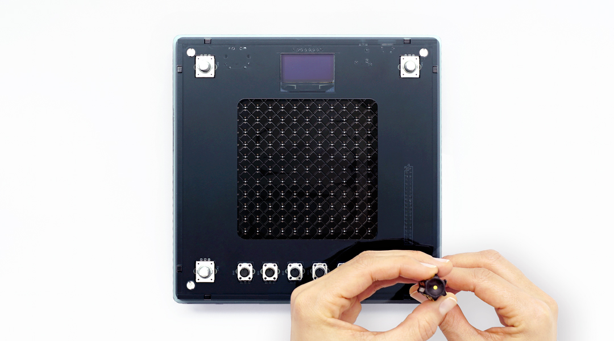

To finish the case, attach the dials to the encoders.

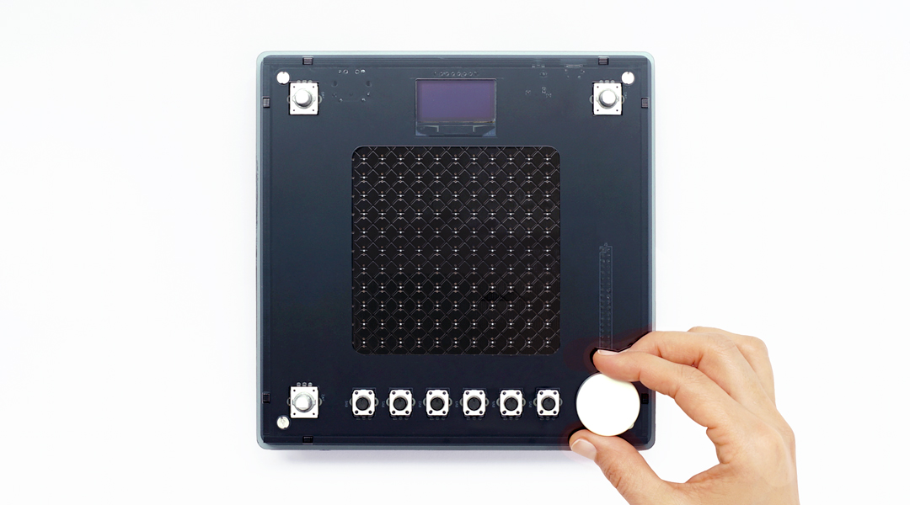

# Hacking the case

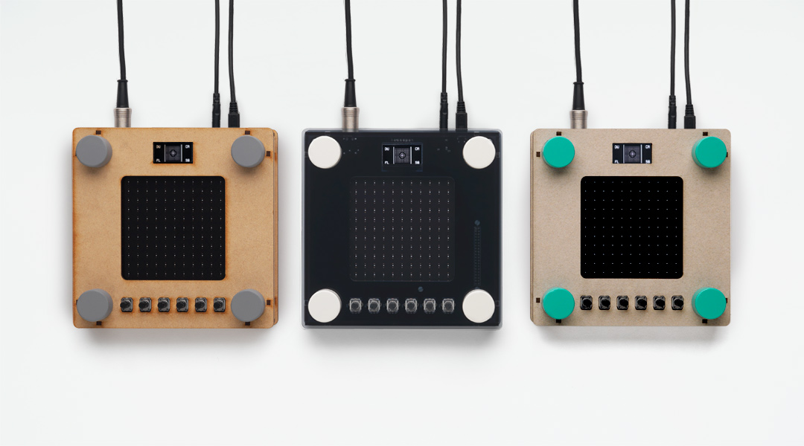

These files are a starting point for creating a reference Open NSynth Super case; experimentation and modification is encouraged, for example adding vector graphics to the .AI file in a separate layer for rastering, or combining different materials and colors.

