# Open NSynth Super PCB hardware

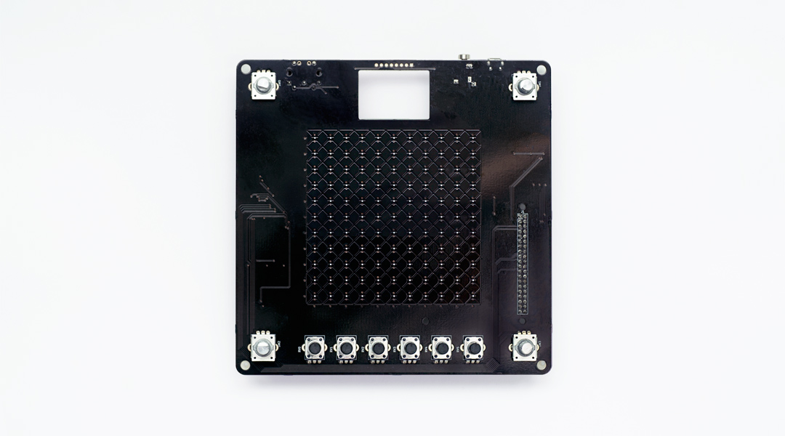

This folder contains all of the source files for making your own Open NSynth Super PCB hardware: a KiCAD project for the PCB in `projects/open-nsynth-super`, rendered gerber files from the KiCAD project in `render/`, and exported schematics from the KiCAD project in `schematics/`.

The PCB design includes a mix of SMT and through-hole components. It is possible to assemble individual boards by hand in a few hours, however for multiple boards it would be advisable to order multiple fully assembled (or at least SMT assembled) PCBs. If you wish to have the PCB manufactured, the files in `render/` should be all you need; additionally, a bill of materials is [available here](https://storage.googleapis.com/open-nsynth-super/onss_bom_1.2.0.xlsx).

For reference, development PCBs were fabricated at the following specification:

- 160mm x 160mm board
- 1.6mm thickness
- 1oz copper
- 2 layers
- Silkscreen both sides
- Smallest drill (for vias) 0.4mm
- Smallest router 0.8mm

# PCB overview

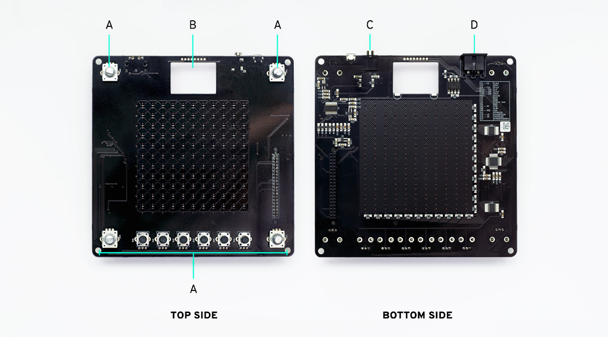

The hardware component of Open NSynth Super provides:

 **(A)** A set of encoders and potentiometers for controlling the audio signal and interface, and a capacitive sensor as a physical interface for controlling the synthesizer voice

 **(B)** Connector for an OLED display module

 **(C)** A dedicated audio output circuit with a 3.5mm audio output

 **(D)** MIDI input via a 5-pin DIN jack

# User inputs

### Rotary encoders

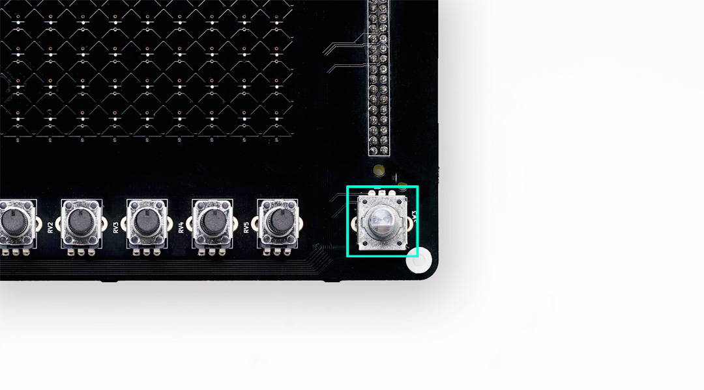

The four instruments are selected by rotary encoders placed in the four corners of the PCB. These are connected to the MCU which keeps track of their changes.

### Potentiometers

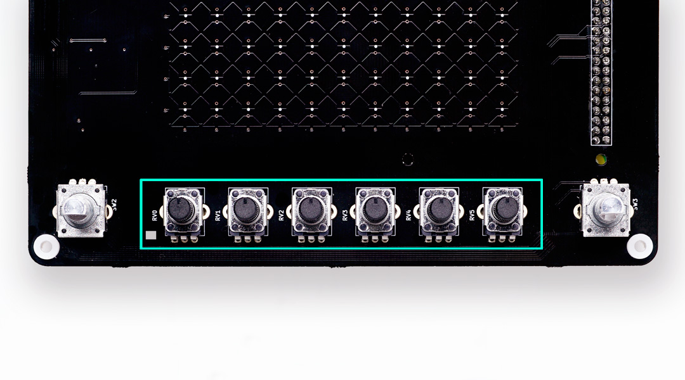

The position, sound envelope and volume are controlled by six potentiometers placed along the bottom edge of the PCB. These are connected to the MCU which performs the ADC conversions to read the current values.

### Touch interface

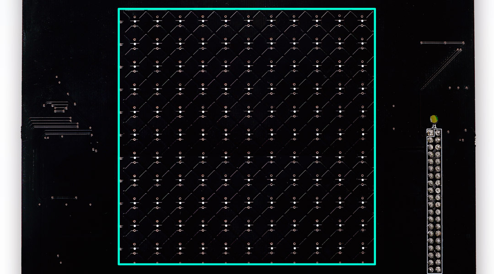

The PCB has a touch sensitive area used to control the interpolation between the four selected instruments. Each axis of the grid is connected to a touch controller IC reading the eleven channels. Because the touch controllers use a fixed I²C address they can not operate on the same bus. For this reason they are not connected to the Raspberry Pi's I²C bus, instead they are connected to the MCU on two additional I²C buses.

# Inputs & outputs

### MIDI

The 5 pin 180 degree MIDI input socket is connected to an opto-isolator circuit. The output of this is connected to the Raspberry Pi's serial input.

### Audio

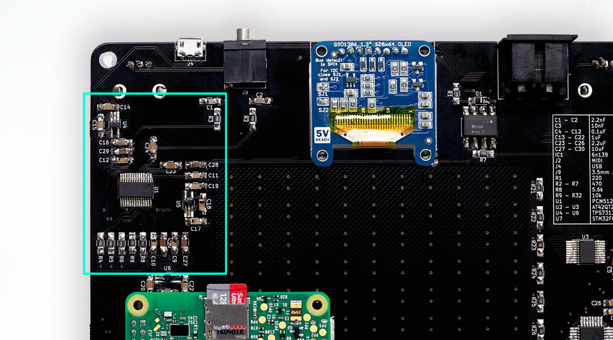

The PCB includes a good quality DAC driving the line out 3.5mm jack. The DAC is connected to the Raspberry Pi's I²S bus for audio data. It is also connected to the Raspberry Pi's I²C bus for volume and other controls.

The DAC's analog and charge pump sources are supplied by two dedicated LDO voltage regulators for improved sound quality.

# Attaching the display

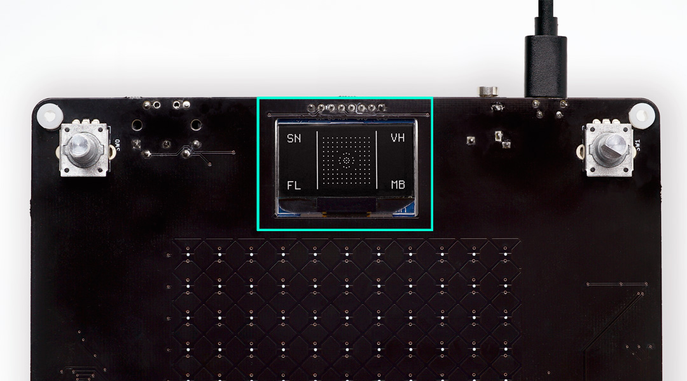

For ease of assembly the display is an [off the shelf module](https://www.adafruit.com/product/938) with a board to board mounting. It is controlled by I²C and is on the Raspberry Pi bus. The module requires reset logic that can be done in hardware but to reduce component count it is done by GPIO instead. The reset pin is connected to a Raspberry Pi GPIO pin. The OLED screen supports two modes: I²C and SPI. By default, it runs in SPI mode, but for Open NSynth Super it should be set to I²C. On the back of the screen there are two jumper pads (SJ1 and SJ2) that need to be soldered to switch to I²C mode:

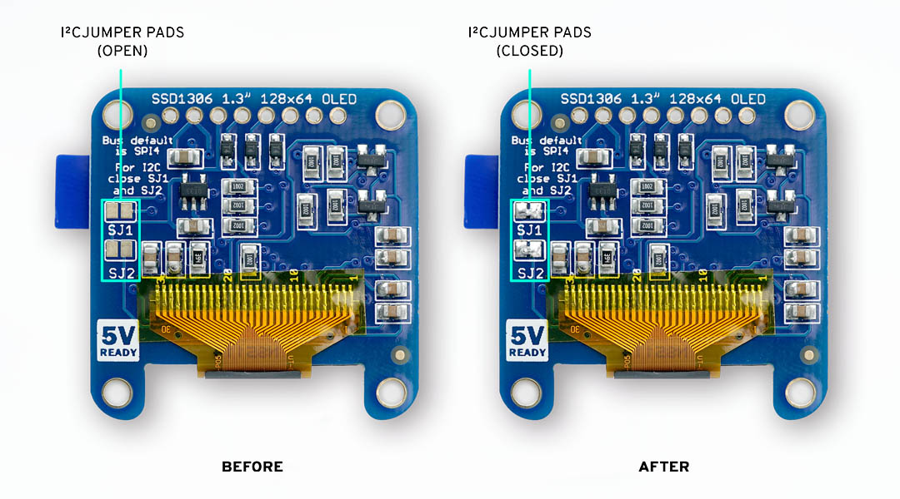

The screen module has a through hole connector that connects it directly to the PCB. To improve mechanical resistance, we suggest to solder also the bottom pads. First, apply some flux on the pads:

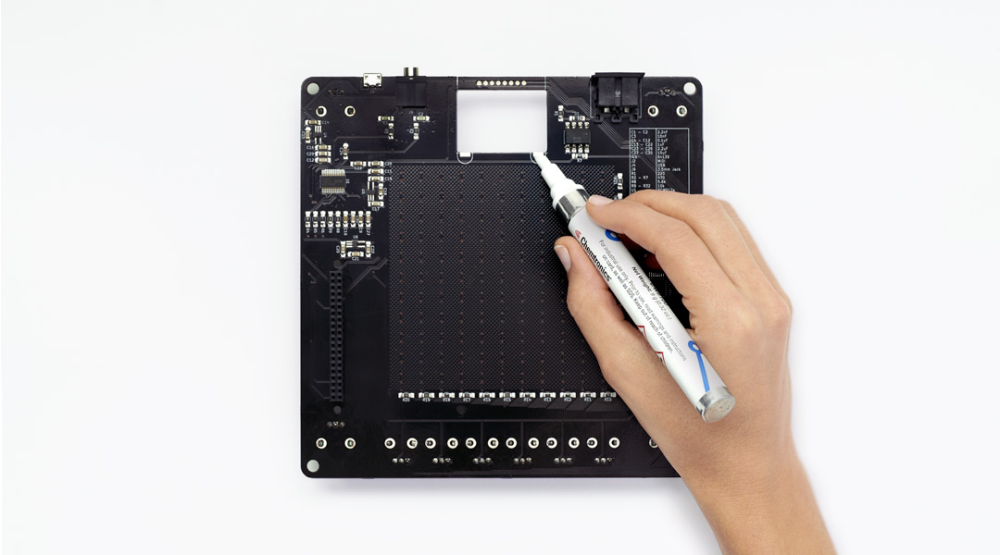

Apply some solder to the pads:

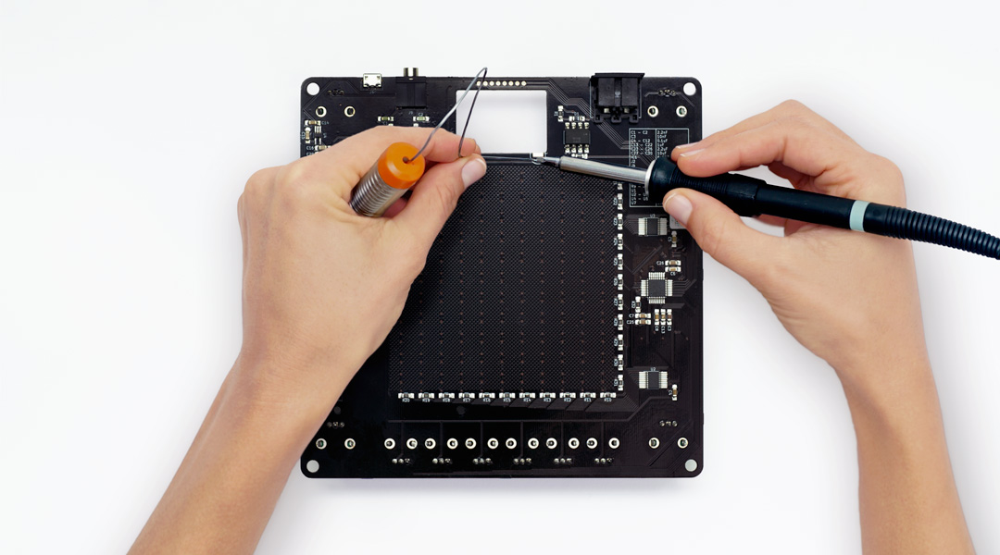

With the screen PCB held in place (you can use electrical tape to help), push one end of the header through both PCBs and solder to the top side of the main Open NSynth Super board:

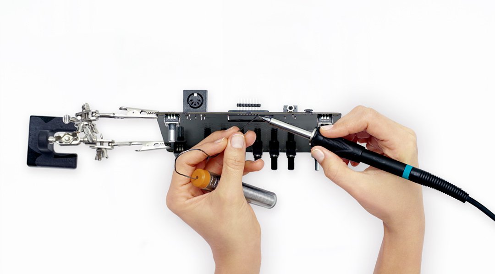

Clip the excess header on the reverse side of the board, leaving enough to securely solder to the screen PCB:

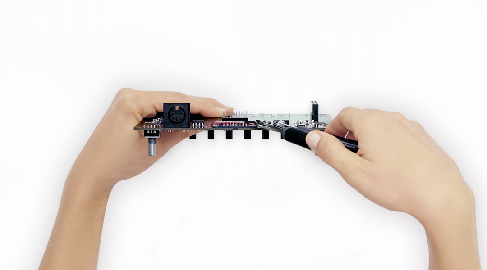

Solder the remaining header connector on the screen board (you can cut away any excess header after this step):

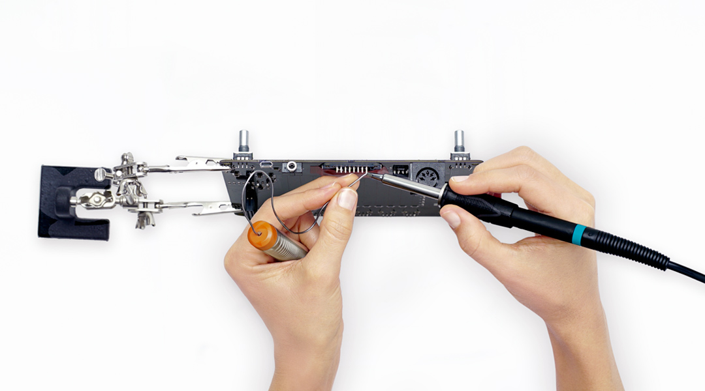

Finally, you need to solder the screen on the bottom pads for extra mechanical strength. Put a good amount of flux in the screen PCB hole:

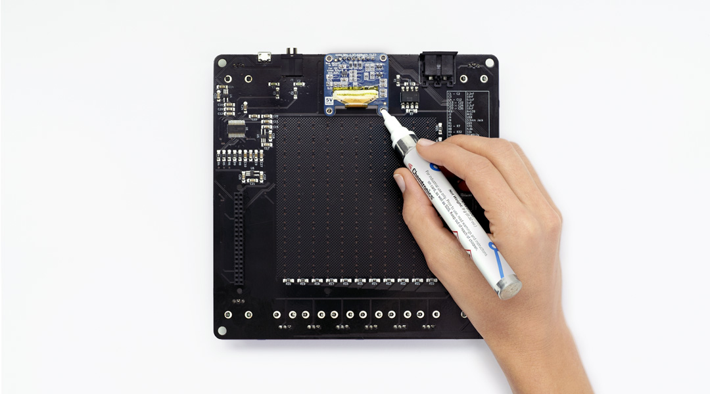

Now, apply a small amount of solder on the tip of the iron, and then, while holding the screen down to the board, hold the iron in the mounting hole for a short period of time (until you feel the solder has melted). Continue holding the board and screen together until you feel that the solder has cooled:

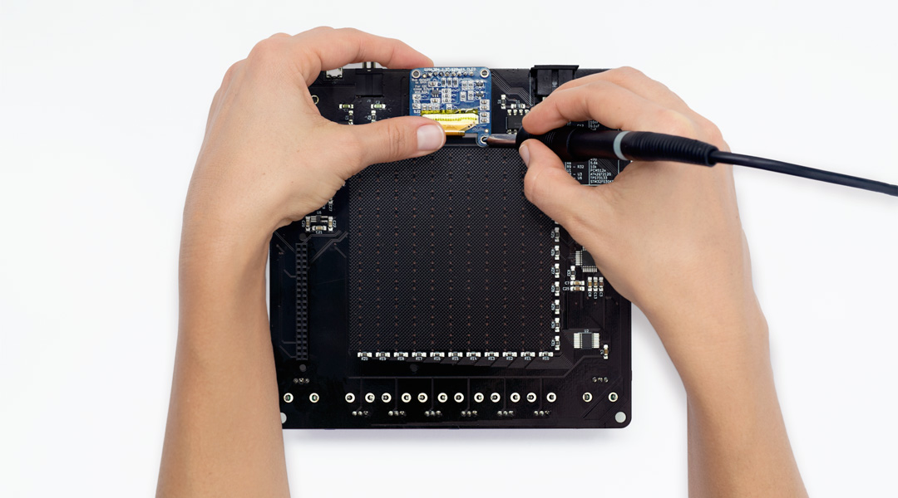

# Finishing the PCB

After soldering the potentiometers and rotary encoders, the pins highlighted below (SW3, RV5, RV4) should be trimmed, to avoid contact with the Raspberry Pi. Optionally, they can also be covered with an insulant material such as electrical tape.

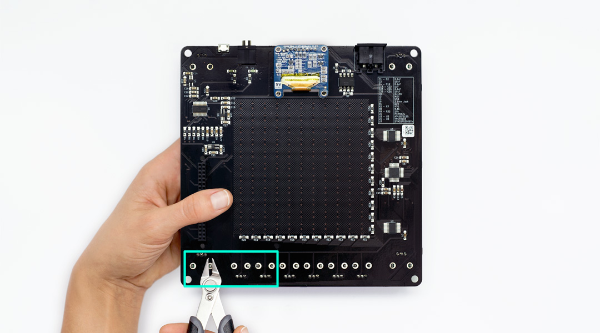

In order to preserve performance of the touch panel, you can add a layer of adhesive plastic to the surface of the board to insulate from moisture (depending on the thickness of the plastic you may wish to adjust the sensitivity of the touch sensor; however the default settings should work for a thin sheet of adhesive plastic.)