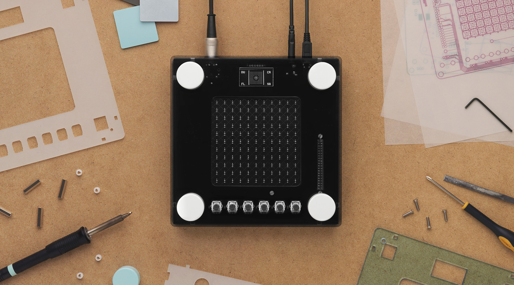
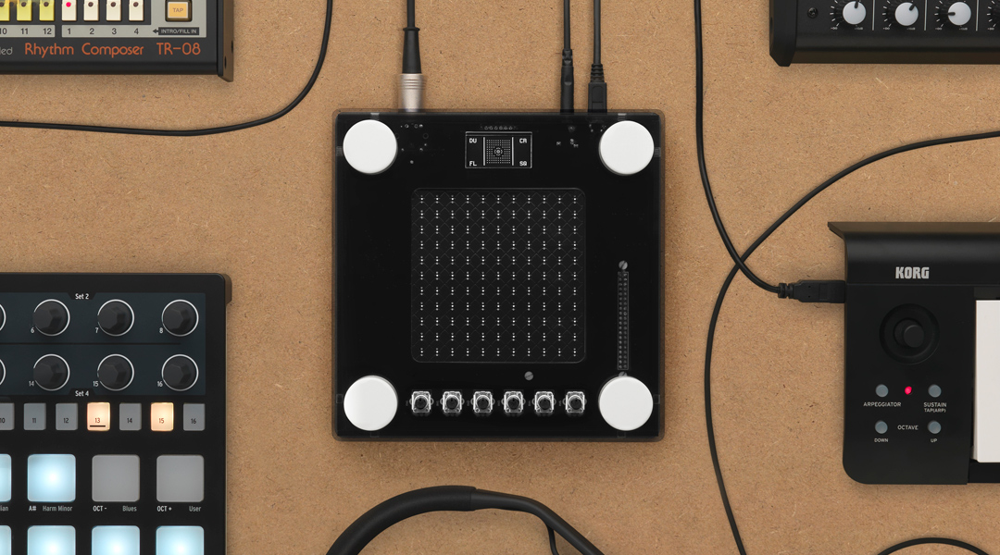
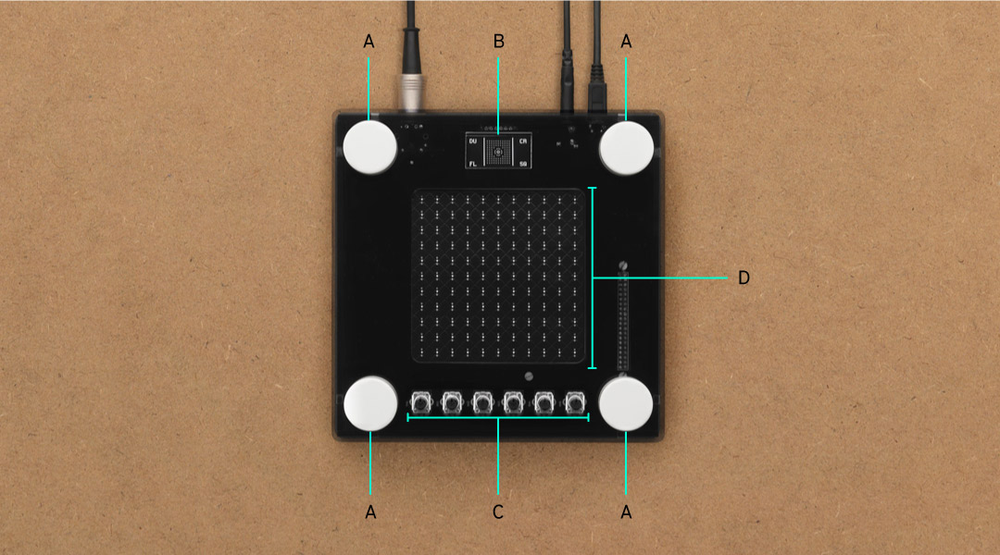
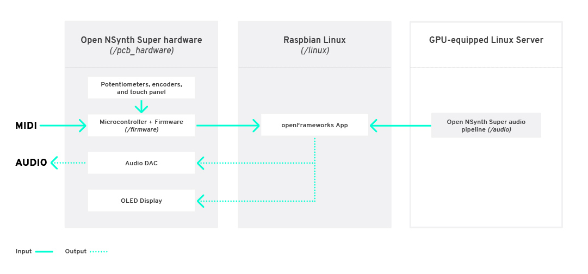
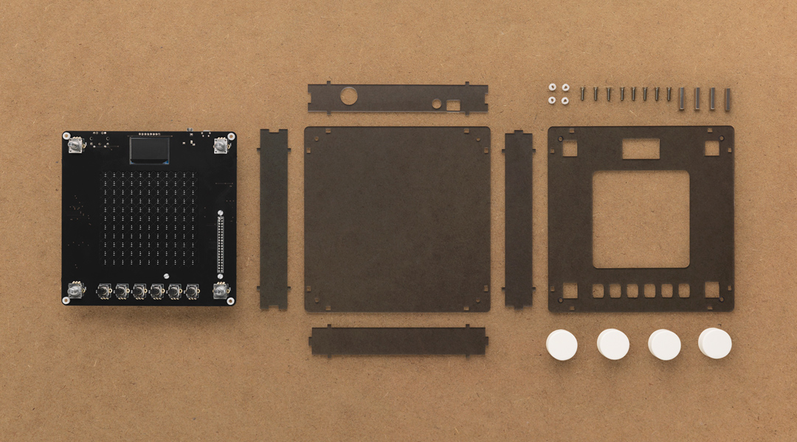
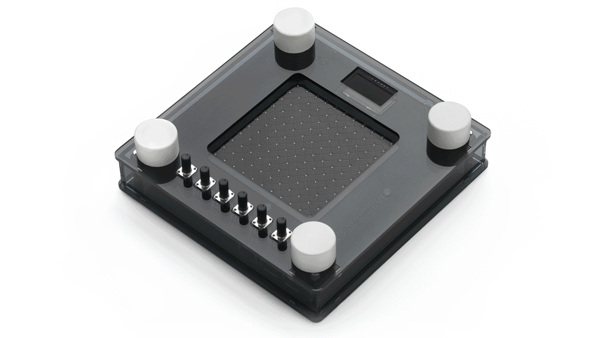

# Open NSynth Super



Open NSynth Super is an experimental physical interface for NSynth, a machine learning algorithm developed by [Google Brain’s Magenta team](https://magenta.tensorflow.org/) to generate new, unique sounds that exist between different sounds. Open NSynth Super allows you to create and explore new sounds that it generates through a simple to use hardware interface that integrates easily into any musician’s production rig. To find out more, visit the [NSynth Super website](https://nsynthsuper.withgoogle.com).

This repository contains all the instructions and files required to build an Open NSynth Super instrument from scratch, and you can use them to make your own version. Anyone can fork the code and schematics to remix the instrument in any way they wish.

### About this document

This document has three chapters – an overview of the instrument itself, a 'make your own' guide, and an overview of the audio creation process.

- [The 'how it works' overview](#how-it-works) summarises the technical and user interface features of the Open NSynth Super instrument.

- [The 'make your own' guide](#guide-how-to-make-open-nsynth-super) takes you through the steps required to build an Open NSynth Super unit and load it with an example Linux image containing pre-computed sample audio, helping you to get started with the instrument straight away.

- [The audio creation overview](#audio-creation-overview) gives a high-level summary of the audio creation pipeline, which enables you to process audio files (on a separate computer) and load the instrument with your own input sounds.

This repository also includes individual chapters on every aspect of Open NSynth Super, so you can build a unit from scratch, or hack and customise any part of it:

- [Application software](/app)
- [Audio creation pipeline](/audio)
- [Case & dials](/case)
- [Firmware & microcontroller](/firmware)
- [OS and provisioning](/linux)
- [PCB and hardware](/pcb_hardware)

# How it works



Open NSynth Super is super simple to integrate into any production music rig. Like many other synthesizer modules, it receives MIDI input via a 5-pin DIN connector, and outputs audio through a 3.5mm jack cable. This simple interface allows it to work with almost any MIDI source, like keyboards, DAWs, or hardware sequencers.

### User interface



The physical interface of Open NSynth Super is constructed around a square touch interface. Using dials in the corners of the touch surface, musicians can select four source sounds and use the touch interface to explore the sounds that the NSynth algorithm has generated between them. In addition, the instrument also has controls for tuning the new sounds via the fine controls.

**(A) Instrument selectors** - These rotary dials are used to select the instruments that are assigned to the corners of the interface.

**(B) OLED display** - A high-contrast display shows you the state of the instrument and additional information about the controls that you are interacting with.

**(C) Fine controls** - These six dials are used to further customize the audio output by the device:

- 'Position' sets the initial position of the wave, allowing you to cut out the attack of a waveform, or to start from the tail of a newly created sound.
- 'Attack' controls the time taken for initial run-up of level from nil to peak.
- 'Decay' controls the time taken for the subsequent run down from the attack level to the designated sustain level.
- 'Sustain' sets the level during the main sequence of the sound's duration, until the key is released.
- 'Release' controls the time taken for the level to decay from the sustain level to zero after the key is released.
- 'Volume' adjusts the overall output volume of the device.

**(D) Touch interface** - This is a capacitive sensor, like the mouse pad on a laptop, which is used to explore the world of new sounds that NSynth has generated between your chosen source audio.


### Technical overview



There are several distinct components to each Open NSynth Super unit: a custom PCB with a dedicated microcontroller and firmware for handling user inputs; a Raspberry Pi computer running Raspbian Linux and an openFrameworks-based audio synthesiser application; and a series of scripts for preparing audio on a GPU-equipped Linux server using the NSynth algorithm. In addition to the software, firmware, and hardware, there are files for creating a casing and dials for the unit.

##### Hardware & firmware

The electronics are built around a Raspberry Pi 3 running Raspbian Linux, and a custom PCB used to read the inputs and control the outputs. A microcontroller on the PCB manages the physical inputs: there are four rotary encoders on the four corners for instrument selection; six potentiometers below the interface to control the position, envelope, and volume settings; and a capacitive grid on the surface of the PCB (exposed through the top layer of the case) used to select the mixing point of the four instruments. 

More information on the electronics, hardware, and firmware can be found [here](/pcb_hardware), and [here](/firmware). A complete bill of materials for the case and electronics is available in this Excel [spreadsheet](https://storage.googleapis.com/open-nsynth-super/onss_bom.xlsx).

##### Software
Open NSynth Super runs a multisampler audio application built on [openFrameworks](http://openframeworks.cc) to process incoming MIDI note data and generate sound output. More information about this application can be found in the [software readme file](/app).

##### Case
We designed a case for the electronics that can be easily manufactured with a laser cutter, and held together with standard screws and fittings. This design is easily customisable using different materials, colors, dials, and shapes. Read more about this in the [case readme file](/case).

##### Audio
Audio for the Open NSynth Super instrument is produced by the NSynth algorithm. Because generating audio requires a great deal of processing power, this repository includes a set of scripts that you can run on a server which will take any audio recordings of your choice and convert them into a format compatible with the instrument. For more information, see the [audio readme file](/audio) or the [audio creation overview](#audio-creation-overview) in this document.

# Guide: How to make Open NSynth Super



This guide gives you an overview of how to create casing and electronics for Open NSynth Super, and load the device with a premade Linux image which is already set up with application software, hardware support, and example sounds.

The example image file includes the following software features:
- Raspbian Linux Lite
- Full configuration to support the Open NSynth Super mainboard
- Open NSynth Super software application pre-loaded and configured
- Sample audio data
- A read-only filesystem for robustness

You will need the following off-the-shelf items to complete this guide:

- Micro SD card (16GB or 64GB)
- Raspberry Pi 3
- 5V 2A micro-USB power supply

You will also need the following Open NSynth Super-specific items, which are detailed in the steps below:

- Open NSynth Super mainboard
- Laser cut Open NSynth Super case
- 3D printed dials (optional)


### 1. Laser cut the shell

This repository contains a reference design for a laser-cut shell for Open NSynth Super. As well as the case design, there are two sizes of 3D-printed dials which can optionally be added to the build. Parts for the case can be cut manually, or obtained easily from a laser-cutting service by supplying these files. More detailed information and specifications for the case can be found in the [case readme](/case) file.

You should make or order a case following the above guide before moving forward with the build. Don't assemble the case yet, as you will need access to the ports on the Raspberry Pi.


### 2. Manufacture and assemble the PCB 

Open NSynth Super is built around a custom PCB with inputs for the hardware controls, audio and data I/O ports, and an OLED display for the UI. The PCB can be ordered fully assembled (this is most cost effective when ordering several boards), or be assembled by hand in a few hours. Further detail on the manufacture and assembly of the board can be found in the [PCB readme](/pcb_hardware) file.

**You will need to obtain or build your PCB before proceeding further with this guide.**

In order to test the board, you will need to have a working Open NSynth Super software installation, which you will prepare at the next step. Before proceeding, connect the Raspberry Pi GPIO pins to the Open NSynth Super mainboard.


### 3. Prepare the SD card

There are two preconfigured OS images available, both loaded with sample audio and fully configured for use with NSynth Super. Depending on the size of your SD card, you can choose either the [64GB image](https://storage.googleapis.com/open-nsynth-super/images/onss_1.1_full.img) or [16GB image](https://storage.googleapis.com/open-nsynth-super/images/onss_1.0_lite.img).

The easiest way to create the SD card is to use GUI software like [Etcher](https://etcher.io/), Win32DiskImager, or the [SD Card Association's](https://www.sdcard.org/downloads/formatter_4/) formatter to burn the example image to a card.

Alternatively, you can use the ``dd`` command natively on *NIX systems:

```
$ sudo dd if=<IMAGE NAME> of=<DISK NAME>
```

 Connect a keyboard and screen to the Raspberry Pi, insert the SD card, and plug a USB power cable into the socket on the Open NSynth Super mainboard. You should see the Pi booting up on the connected display; when you receive a prompt, you can login with the default username and password: pi / raspberry. **Note that the device might run a file system check when you first boot up from the new card – this will take about 5 minutes depending on the size of the disk.**

### 4. Install the firmware

The firmware will need to be loaded to the microcontroller on your Open NSynth Super mainboard. This allows the software application running on the Raspberry Pi to interact with the controls.

Because the file system is locked for robustness, you will need to remount the disk as read/write by running the following command on your Raspberry Pi:

```
$ sudo mount -o remount,rw /
```

Next, navigate to the firmware directory and run the install command:

```
$ cd /home/pi/open-nsynth-super-master/firmware/src
$ make install
```

This command will build and install the firmware to the microcontroller. You will receive a message on screen confirming the operation has been successful:

```
** Programming Started **
auto erase enabled
Info : device id = 0x10006444
Info : flash size = 32kbytes
wrote 12288 bytes from file ../bin/main.elf in 0.607889s (19.740 KiB/s)
** Programming Finished **
** Verify Started **
verified 11788 bytes in 0.050784s (226.680 KiB/s)
** Verified OK **
** Resetting Target **
adapter speed: 1001 kHz
shutdown command invoked
```

More detailed information about the firmware can be found in the [firmware readme](/firmware) file. When the firmware installation is complete, you can power down the system using the following command, and move to the next step:

```
$ sudo poweroff
```

### 5. Verify the installation

Before assembling the shell and 'finishing' the instrument, it's important to check that everything is functioning correctly. To do this, plug in a MIDI device (like a keyboard), a pair of headphones or speakers, and power on the instrument. 

After a few seconds, you should see the grid interface appear on the OLED screen. Move your finger around the touch interface to test its responsiveness. Next, adjust the six controls at the base of the unit; the UI should update according to the control that you are adjusting. Finally, test the four instrument selection encoders, which will scroll through an instrument list on the screen.

To test the audio, ensure your MIDI device is broadcasting on channel 1 (the default channel), and send some notes to the device. You should hear audio coming from the speakers or headphones (if you don't hear anything, make sure the device audio is turned up, and that the envelope and position controls aren't cutting the audible part of the waveform).

Because the standard image is preconfigured, you can use it to test that your Open NSynth Super mainboard is functioning correctly. If all features are up and running, you can move on to final assembly.

### 6. Assemble the shell

Now that you have a fully functioning instrument, you can finally build it into its shell. Power the unit down, remove all connections (e.g. screen, keyboard, MIDI, power), and follow the instructions found [here](/case).



### 7. Play with Open NSynth Super

With the case assembled, firmware installed, and the device tested, you're ready to go and make music with your Open NSynth Super. There are detailed readmes in this repository for the software application, case, PCB and audio creation pipeline if you want to go into more detail, or start hacking the device.


# Audio creation overview

Sounds for Open NSynth Super are created using the neural synthesis technique implemented by Google Brain’s [Magenta](https://magenta.tensorflow.org/) team as part of their NSynth project. You can read more about Magenta and NSynth on their [project page](https://github.com/tensorflow/magenta/tree/master/magenta/models/nsynth). 

Because generating audio requires a great deal of processing power, this repository includes a set of scripts that you can run on a server which will take any audio recordings of your choice and convert them into a format compatible with the instrument. This audio pipeline is built on top of the NSynth implementation available through [Magenta's GitHub page](https://github.com/tensorflow/magenta/tree/master/magenta/models/nsynth).

The pipeline has the following stages:

1. Assemble input audio files and assign sounds to corners of the interface
2. Calculate the embeddings of the input sounds with the NSynth model
3. Interpolate between these to create a set of embeddings for newly generated sounds
4. Generate the audio
5. Remove crackles and other artifacts from the generated audio
6. Package and deploy the audio to the device

**More detailed instructions on how to run the pipeline, including how to set up and provision a GPU-equipped Linux server for processing audio, are available [here](/audio).**

---

### Notes
This is a collaborative effort between Google Creative Lab and [Magenta](https://github.com/tensorflow/magenta), [Kyle McDonald](https://github.com/kylemcdonald), and our partners at [RRD Labs](https://github.com/dgym). This is not an official Google product.

We encourage open sourcing projects as a way of learning from each other. Please respect our and other creators’ rights, including copyright and trademark rights when present when sharing these works and creating derivative work. If you want more info on Google's policy, you can find it [here](https://www.google.com/permissions/). To contribute to the project, please refer to the [contributing](CONTRIBUTING.md) document in this repository.